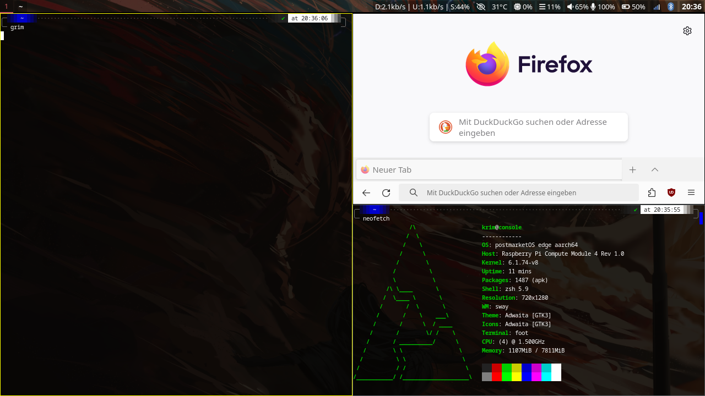

# My Clockwork uConsole Config Files

This repository contains my personal configuration files for Waybar, Sway and Foot, used for the Clockwork uConsole on Alpine Linux via PostmarketOS. These are based on multiple sources, tutorials and references from everywhere DDG could lead me, but relies heavily on **https://github.com/emdash/uConsole_sway_config**, so please check his repo for further details.

## ⚠️ For Reference Only

These config files are provided as a reference and are not intended to work out-of-the-box. They require specific setup and dependencies. Only use these if you know what you're doing!

## 📂 Config Files

- `waybar/config` - Waybar configuration
- `waybar/style.css` - Waybar styling 
- `sway/config` - Sway window manager configuration
- `foot/foot.ini` - Foot terminal emulator settings

## 🏔️ Alpine Linux Setup

Instructions for reproducing my Clockwork uConsole setup on Alpine Linux can be found in the [setup-guide.md](setup-guide.md).

---

Feel free to explore the code and adapt it for your own setup. Happy hacking! 🚀

