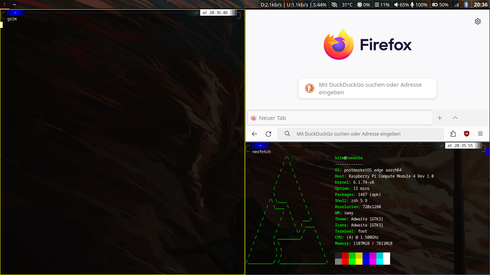

# Clockwork uConsole - Sway Setup

My personal Wayland setup for the Clockwork uConsole running **Debian Trixie** on a **Raspberry Pi 5 / CM5** module. Window manager: **swayfx** (sway with blur, rounded corners, shadows). Theme: **Gruvbox Dark**.

## Components

| Tool                  | Purpose                                      |
|-----------------------|----------------------------------------------|
| swayfx 0.5.3          | Tiling Wayland compositor with eye candy    |
| waybar                | Status bar (Gruvbox-themed)                  |
| foot                  | Terminal emulator (Gruvbox-themed)           |
| fuzzel                | Application launcher (replaces wofi)         |
| mako                  | Notification daemon                          |
| swaylock              | Screen lock (mainline; effects-fork breaks on swayfx)|
| swayidle              | Idle handling: lock, backlight off           |
| autotiling            | Automatic split direction                    |
| pipewire + wireplumber| Audio (handles HDMI hotplug natively)        |
| audio-hotswitch       | Auto-switch default sink to HDMI when present|
| fscrypt + pam_fscrypt | Transparent `/home` encryption, login-passphrase wrapped |
| RetroArch + cores     | Emulators (libretro)                         |
| ES-DE                 | EmulationStation Desktop Edition frontend    |

## Files

- `config/sway/`    - sway config + wallpaper
- `config/waybar/`  - waybar config + Gruvbox CSS
- `config/foot/`    - foot terminal config (Gruvbox colors)
- `config/fuzzel/`  - launcher theme
- `config/mako/`    - notification theme
- `audio-hotswitch` - shell script, deployed to `/usr/local/bin/`
- `lock-screen`     - swaylock wrapper with pre-blur + auto-dim (deployed to `/usr/local/bin/`)
- `vimrc`, `zshrc`  - dot files (oh-my-zsh + powerlevel10k)

## Hardware specifics (Pi 5 uConsole)

- DSI panel on `DSI-2`, native portrait 720x1280, rotated to landscape via `transform 90`.
- Keyboard USB ID `1eaf:0024`, keymap handled by the OS.
- Audio via pipewire-pulse; default sink follows HDMI hotplug via `audio-hotswitch`.
- exFAT via the kernel-native driver (`exfat.ko`); `exfat-fuse` not needed.
- Encrypted `/home` via fscrypt + `pam_fscrypt`, key wrapped with the login passphrase (setup-guide.md §9).
- Second SD card (exFAT) auto-mounts at `/mnt/sdcard` via fstab independent of the desktop session (setup-guide.md §10).
- No HDMI display mirror.

## Setup

See [setup-guide.md](setup-guide.md) for installation steps.

